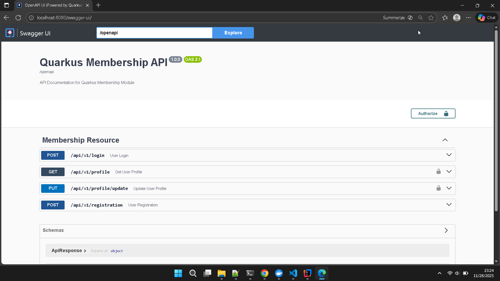

# Quarkus Membership REST API



This project is a REST API for membership management built with Quarkus, the supersonic and subatomic Java framework. This API provides user registration, login, and profile management features with JWT authentication.

## 🚀 Key Features

- **User Registration**: New user registration with email validation
- **JWT Authentication**: Secure login with JWT tokens
- **Profile Management**: View and update user profiles
- **Input Validation**: Input data validation with Jakarta Bean Validation
- **API Documentation**: OpenAPI 3.0 with Swagger UI
- **PostgreSQL Database**: Data persistence with Hibernate ORM Panache
- **Security**: Role-based and path-based security configuration

## 📋 Prerequisites

- Java 17 or higher
- Apache Maven 3.8.1+
- PostgreSQL 12+
- Docker (optional, for running the database)

## 🛠️ Technologies Used

- **Quarkus 3.30.1**: Modern Java framework
- **Jakarta REST**: REST API implementation
- **Hibernate ORM with Panache**: Simplified ORM
- **PostgreSQL**: Relational database
- **JWT (JSON Web Token)**: Stateless authentication
- **SmallRye OpenAPI**: API documentation
- **Lombok**: Boilerplate code reduction
- **Bean Validation**: Input data validation

## 🏗️ Project Structure

```
src/main/java/org/quarkus/rest/
├── QuarkusRestApplication.java     # Main application class
├── controller/
│   └── MembershipResource.java     # REST API endpoints
├── dto/
│   ├── ApiResponse.java             # Response wrapper
│   ├── LoginRequest.java            # Login DTO
│   ├── LoginResponse.java           # Login response DTO
│   ├── ProfileResponse.java         # Profile response DTO
│   ├── ProfileUpdateRequest.java   # Profile update DTO
│   └── RegistrationRequest.java     # Registration DTO
├── entity/
│   └── User.java                    # User entity
├── repository/
│   └── UserRepository.java          # Data access layer
└── service/
    └── TokenService.java            # JWT token generation
```

## 🚀 Running the Application

### Development Mode

Run the application in development mode with live coding support:

```bash
./mvnw quarkus:dev
```

The application will run at `http://localhost:8080`

> **Note**: Quarkus provides Dev UI accessible at `http://localhost:8080/q/dev/`

### Running with Docker

1. Run PostgreSQL with Docker:

```bash
mvn clean install -DskipTests
```

```bash
docker-compose up -d postgres
```

2. Run the application:

```bash
./mvnw quarkus:dev
```

## 📦 Packaging and Deployment

### Application Packaging

```bash
./mvnw package
```

This will generate the `quarkus-run.jar` file in the `target/quarkus-app/` directory.

### Creating Uber-JAR

```bash
./mvnw package -Dquarkus.package.jar.type=uber-jar
```

### Native Executable

```bash
./mvnw package -Dnative
```

Or if you don't have GraalVM:

```bash
./mvnw package -Dnative -Dquarkus.native.container-build=true
```

## 📚 API Documentation

### Swagger UI

Access interactive API documentation at:
- **Swagger UI**: `http://localhost:8080/swagger-ui`
- **OpenAPI Spec**: `http://localhost:8080/openapi`

### API Endpoints

#### 1. User Registration

```http
POST /api/v1/registration
Content-Type: application/json

{
  "email": "user@example.com",
  "firstName": "John",
  "lastName": "Doe",
  "password": "Password123!"
}
```

#### 2. Login

```http
POST /api/v1/login
Content-Type: application/json

{
  "email": "user@example.com",
  "password": "Password123!"
}
```

#### 3. Get Profile (Requires JWT)

```http
GET /api/v1/profile
Authorization: Bearer <JWT_TOKEN>
```

#### 4. Update Profile (Requires JWT)

```http
PUT /api/v1/profile/update
Content-Type: application/json
Authorization: Bearer <JWT_TOKEN>

{
  "firstName": "John Updated",
  "lastName": "Doe Updated"
}
```

## 🔧 Configuration

### Database

Database configuration is in `src/main/resources/application.properties`:

```properties
quarkus.datasource.jdbc.url=jdbc:postgresql://localhost:5432/quarkus_db
quarkus.datasource.username=quarkus_user
quarkus.datasource.password=quarkus_password
```

### JWT

JWT configuration:

```properties
smallrye.jwt.sign.key.location=/deployments/jwt-secret-key
mp.jwt.verify.issuer=https://yourdomain.com
smallrye.jwt.token.header=Authorization
smallrye.jwt.token.scheme=Bearer
```

### Security

Path security configuration:

```properties
# Paths requiring authentication
quarkus.http.auth.permission.authenticated.paths=/api/v1/profile,/api/v1/profile/update
quarkus.http.auth.permission.authenticated.policy=authenticated

# Public paths
quarkus.http.auth.permission.public.paths=/api/v1/registration,/api/v1/login,/openapi,/swagger-ui
quarkus.http.auth.permission.public.policy=permit
```

## 🧪 Testing

### HTTP Request File

The project includes a `test.http` file for testing the API with the VS Code REST Client extension.

### Running Tests

```bash
./mvnw test
```

## 🔐 Security

- **Password**: Currently stored as plain text (for development)
- **JWT Token**: Valid for 12 hours
- **Input Validation**: Using Jakarta Bean Validation
- **Path Security**: Path-based security configuration

## 🚨 Important Notes

1. **Password Hashing**: For production, implement password hashing with BCrypt or Argon2
2. **Environment Variables**: Use environment variables for sensitive configuration
3. **HTTPS**: Enable HTTPS for production
4. **Rate Limiting**: Consider adding rate limiting to login endpoints
5. **CORS**: Configure CORS if frontend and backend are separate

## 📈 Monitoring

Quarkus provides various endpoints for monitoring:

- Health Check: `http://localhost:8080/q/health`
- Metrics: `http://localhost:8080/q/metrics`
- Info: `http://localhost:8080/q/info`


This project is licensed under the MIT License - see the [LICENSE](LICENSE) file for details.

## 🔗 Important Links

- [Quarkus Documentation](https://quarkus.io/guides/)
- [Quarkus Getting Started](https://quarkus.io/guides/getting-started)
- [Jakarta REST](https://jakarta.ee/specifications/restful-ws/)
- [JWT Specification](https://tools.ietf.org/html/rfc7519)
- [OpenAPI Specification](https://swagger.io/specification/)
